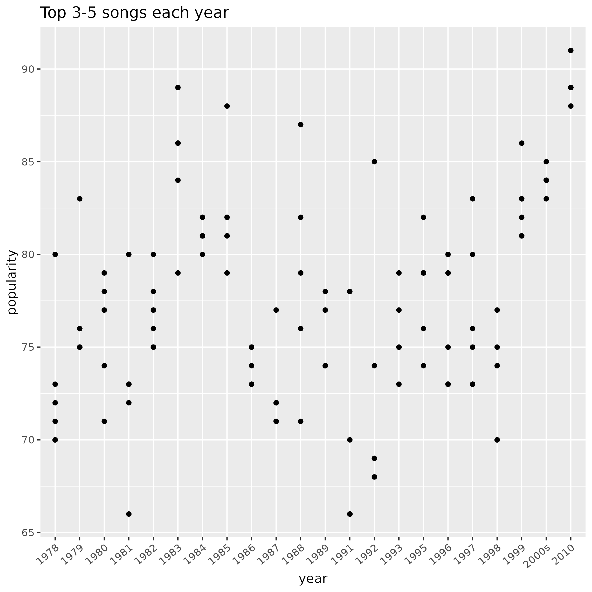
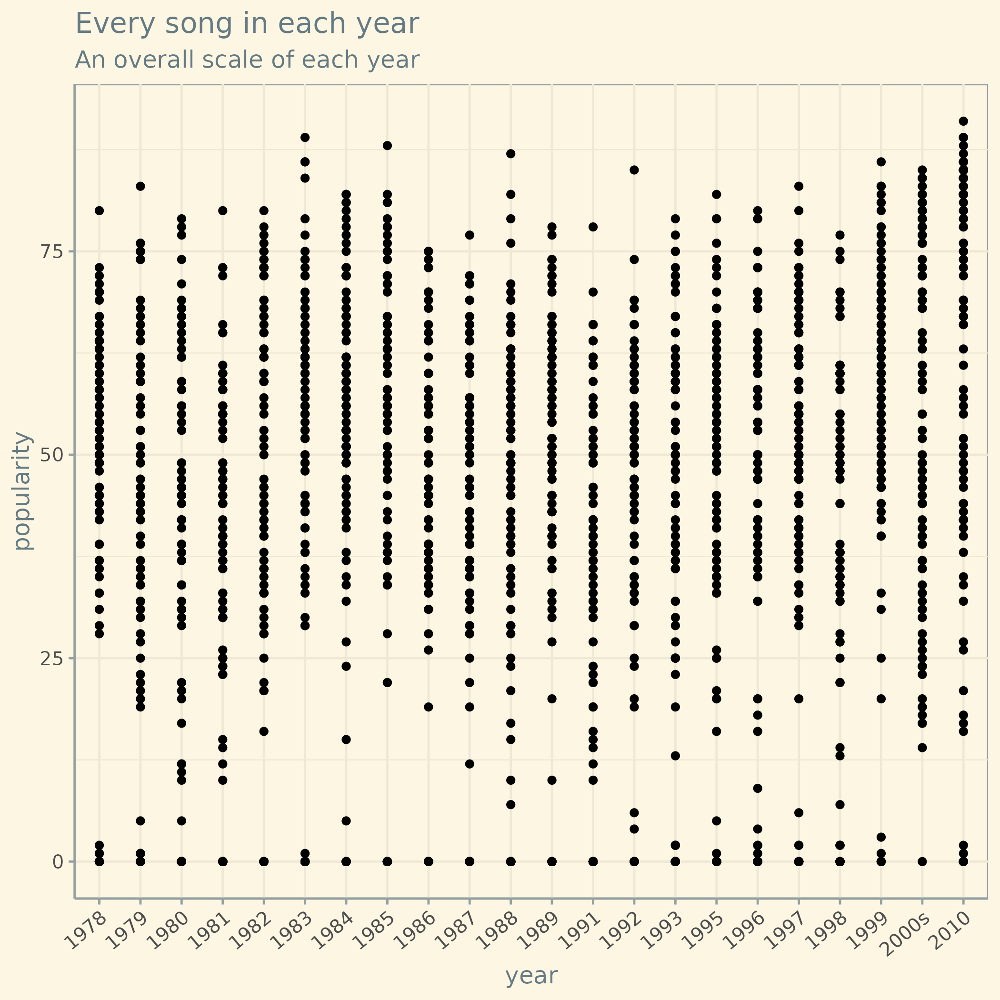
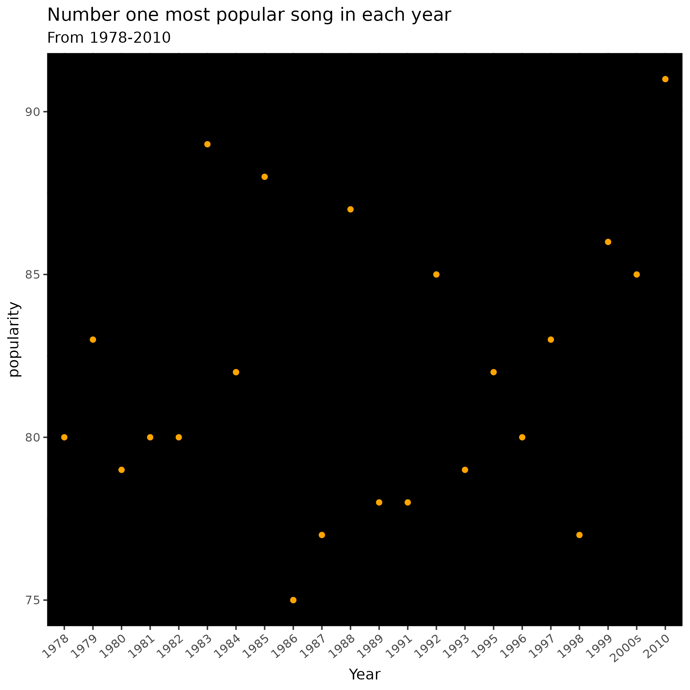

my goals for this project

1. show popular songs popularity over each decade

2. Compare popular and unpopular songs in each different subclass, loudness, danceability, energy, instrumentalness, acousticness, valence, speechiness, tempo, key and liveness

I found that song popularities do increase through out the 90s on into the 2000s I also found that theres no difference in each subclass so that means that unpopular songs try to copy or remix popular tracks

